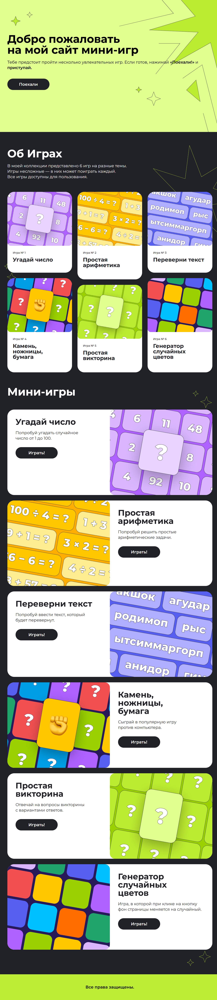

# Mini-Games Collection — Коллекция мини-игр на JavaScript

## 📌 О проекте
Mini-Games Collection — это интерактивный веб-сайт, представляющий собой портфолио из 6 мини-игр, реализованных на чистом JavaScript. Проект демонстрирует навыки работы с DOM, пользовательским вводом, генерацией случайных значений и созданием отзывчивого интерфейса.

**Коллекция игр:**
1. Угадай число — классическая игра с угадыванием числа от 1 до 100
2. Простая арифметика — решение случайных математических задач
3. Переверни текст — реверс введенного текста с определением палиндромов
4. Камень, ножницы, бумага — игра против компьютера
5. Простая викторина — вопросы с вариантами ответов
6. Генератор случайных цветов — изменение фона страницы

## 🔗 Ссылки
- **Репозиторий:** https://github.com/jteterev/games
- **Демо:** https://jteterev.github.io/games/

## 🛠 Технологии
- **Верстка:** HTML5 (семантическая)
- **Стилизация:** CSS3 / SASS (SCSS) — переменные, вложенность, медиа-запросы
- **Программирование:** JavaScript (ES6+) — чистый JS без фреймворков
- **Методология:** БЭМ (классы вида `block__element_modifier`)
- **Адаптивность:** Desktop-first, 3 брейкпоинта (десктоп, планшет, мобильные)
- **Графика:** SVG-иконки (декоративные звезды), оптимизированные PNG для игр

## ✨ Что реализовано

### Общее
- [x] Единый стиль для всех страниц
- [x] Адаптивная верстка для всех устройств
- [x] Семантическая верстка с использованием header, footer, section
- [x] БЭМ-именование для масштабируемости кода
- [x] Плавный скролл к разделам (scroll-behavior: smooth)
- [x] Декоративные SVG-элементы (звезды) для визуальной привлекательности

### Главная страница (index.html)
- [x] Hero-блок с заголовком, описанием и кнопкой призыва к действию
- [x] Декоративные звезды (адаптивные — разные для десктопа и мобильных)
- [x] Секция "Об Играх" с кратким описанием коллекции
- [x] Сетка превью игр в формате masonry (column-count) с разной высотой карточек
- [x] Карточки игр с изображением, номером и названием
- [x] Анимация увеличения карточек при наведении (scale 1.05)

### Секция мини-игр
- [x] Заголовок раздела
- [x] Детальные карточки каждой игры с описанием
- [x] Чередование расположения (изображение слева/справа) для визуального разнообразия
- [x] Кнопки "Играть!" для запуска каждой игры
- [x] Адаптивное перестроение на мобильных (изображение сверху, контент снизу)

### JavaScript-игры

#### 1. Угадай число (GuessNumber.js)
- [x] Генерация случайного числа от 1 до 100
- [x] Цикл ввода с подсказками "больше/меньше"
- [x] Подсчет количества попыток
- [x] Защита от некорректного ввода
- [x] Возможность выхода из игры

#### 2. Простая арифметика (SimpleArithmetic.js)
- [x] Генерация случайных задач (+, -, *, /)
- [x] Корректная обработка деления (округление до 2 знаков)
- [x] Подсчет счета и процента правильных ответов
- [x] Возможность продолжать игру или выйти
- [x] Защита от некорректного ввода

#### 3. Переверни текст (TurnText.js)
- [x] Реверс введенного текста
- [x] Определение палиндромов (текст одинаково читается в обе стороны)
- [x] Обработка пустого ввода
- [x] Возможность выхода через команду "exit"

#### 4. Камень, ножницы, бумага (RockPaper.js)
- [x] Выбор пользователя через цифры (1-камень, 2-ножницы, 3-бумага)
- [x] Случайный выбор компьютера
- [x] Определение победителя по правилам игры
- [x] Валидация ввода

#### 5. Простая викторина (SimpleQuiz.js)
- [x] Массив вопросов с вариантами ответов
- [x] Интерактивный опрос с проверкой
- [x] Подсчет правильных ответов
- [x] Итоговый результат с персонализированным комментарием

#### 6. Генератор случайных цветов (ColorGenerator.js)
- [x] Генерация случайного RGB-цвета
- [x] Изменение фона страницы
- [x] Вывод информации о цвете (HEX и RGB)
- [x] Простое и наглядное взаимодействие

### Особенности верстки
- **SASS-архитектура:** стили организованы с использованием вложенности и переменных
- **Адаптивные декоративные элементы:** разные наборы звезд для мобильных и десктопа
- **Медиа-запросы:** 3 ключевых брейкпоинта (1024px, 768px, hover-устройства)
- **Кастомные кнопки:** стилизованные кнопки с hover-эффектами
- **Masonry-сетка:** реализована через column-count для нестандартного расположения карточек

## 📸 Скриншоты

### Главная страница

### Мобильная версия
.png)

## 🚀 Моя роль
Я выполнил полный цикл разработки:
1. Верстка всех секций с нуля
2. Разработка дизайна с декоративными элементами
3. Программирование всех 6 игр на чистом JavaScript
4. Обработка пользовательского ввода и валидация
5. Адаптация под все устройства
6. Создание интерактивных сценариев для каждой игры

## 💡 Особенности проекта
- **Чистый JavaScript:** все игры реализованы без использования фреймворков и библиотек
- **Обработка ошибок:** каждая игра защищает от некорректного ввода
- **Декоративные SVG-элементы:** звезды создают уникальный визуальный стиль
- **Адаптивный дизайн с разными наборами звезд** для мобильных и десктопа
- **Masonry-сетка вручную:** карточки разной высоты органично смотрятся в многоколоночном макете
- **Палиндромы:** дополнительная фича в игре "Переверни текст"
